# China Map Update README

This document provides details on the parameters, data, and methods used to generate a series of geographic embeddings and visualizations for a map of China. 

### Parameters for Plots
The following parameters were applied in the generation of the China map visualizations:

- **Data Dimensions:** Shape = `(10009, 3)`
- **Longitude (X-axis):** Measured in kilometers (KM)
- **Latitude (Y-axis):** Measured in kilometers (KM)
- **Altitude (Color):** Illustrated using a color gradient based on elevation

### Altitude Color Scheme
Altitude values were mapped to colors to indicate different terrain types:

- **Green** (`#009900`): Sea level
- **Yellow** (`#ffff00`): Plains
- **Light Orange** (`#ffcc66`): Hills
- **Orange-Brown** (`#cc6600`): Highlands
- **Brown-Red** (`#A52A2A`): Mountains
- **Dark Brown** (`#663300`): Highest peaks

### Data Specification
The dataset used in this project is structured as follows:

- **Data Array (D):** `(10009, 3)`
  - `X = D[:, 0]`: Longitude
  - `Y = D[:, 1]`: Latitude
  - `Z = D[:, 2]`: Altitude

### Original Graph Plot
The original graph plot was designed with an equal axis aspect ratio (`ax.set_aspect('equal')`) for consistency across visualizations.

### Embedding Algorithms
Multiple embedding algorithms were applied to the dataset for visualization purposes. The embeddings are organized in sets and executed with consistent parameters (`N=10009, r=69, h=69`). The algorithms used include:

1. **LE**  
   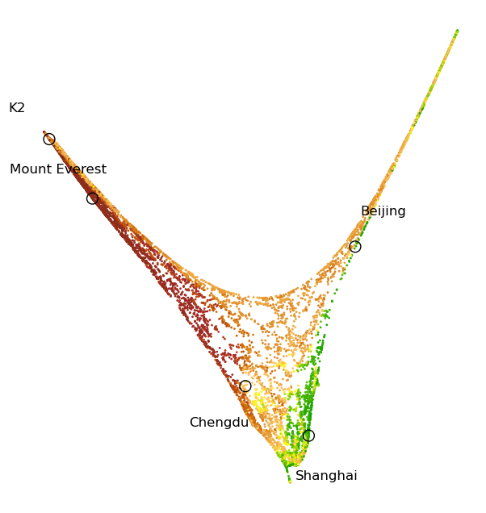 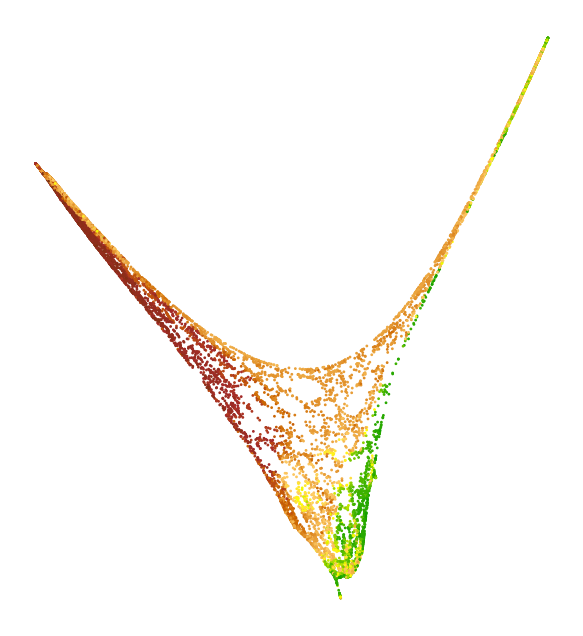 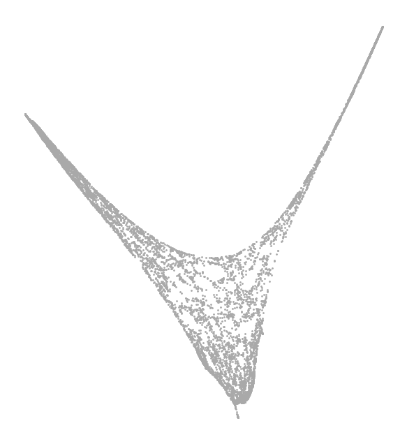  
   `N=10009, r=69, h=69`

2. **LLE**  
   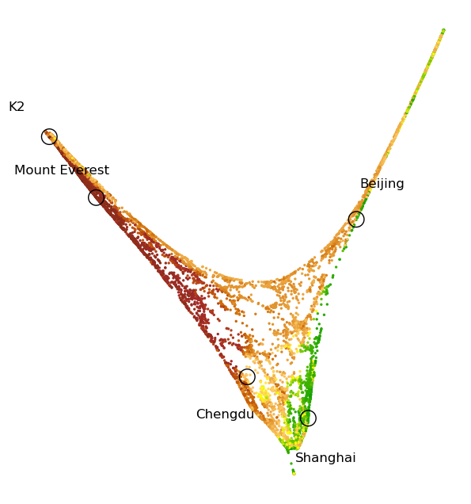    
   `N=10009, r=69, h=69`

3. **Isomap**  
   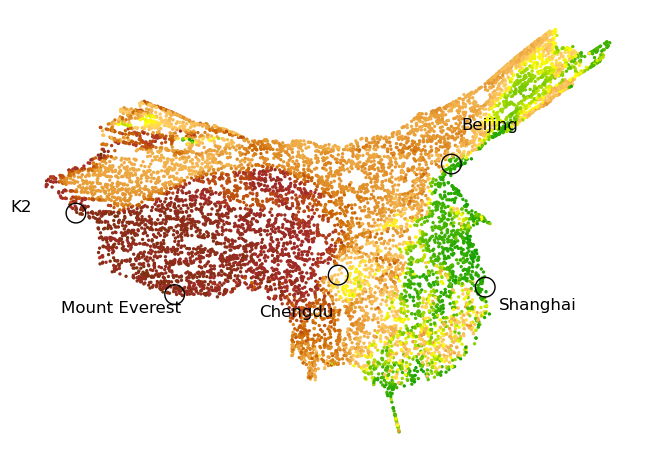 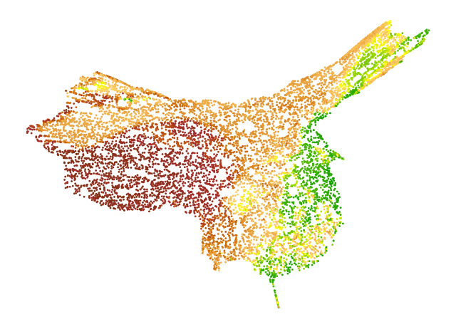 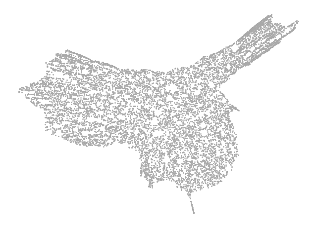  
   `N=10009, r=69, h=69`

4. **LTSA**  
   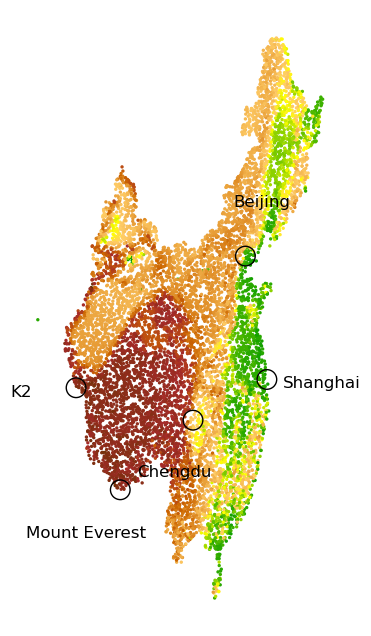 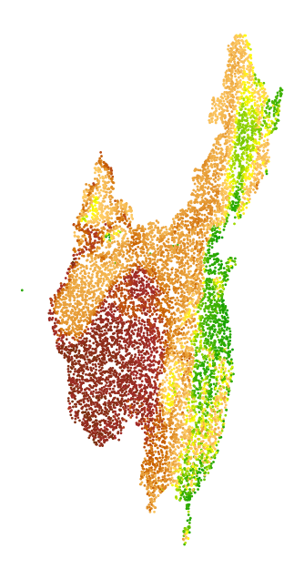 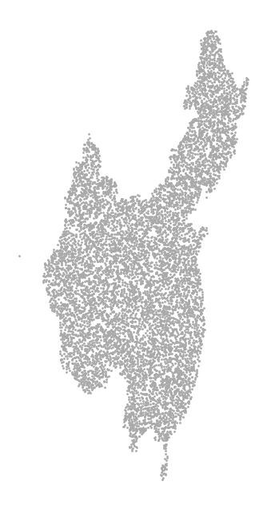  
   `N=10009, r=69, h=69`

5. **tsne**  
   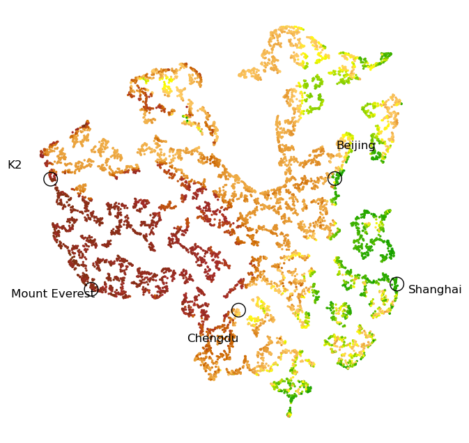 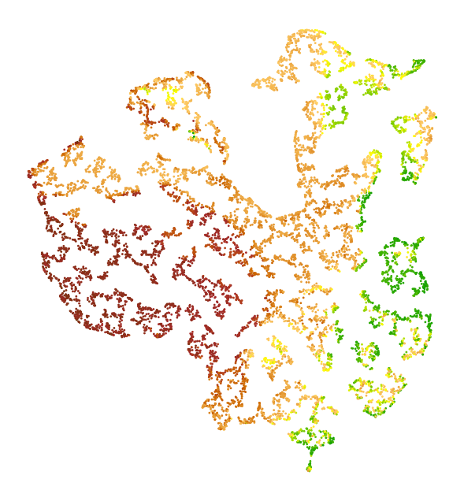 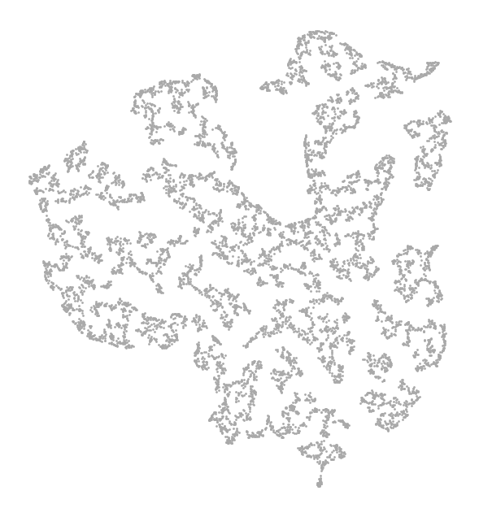  
   `N=10009, r=69, h=69`

6. **UMAP**  
   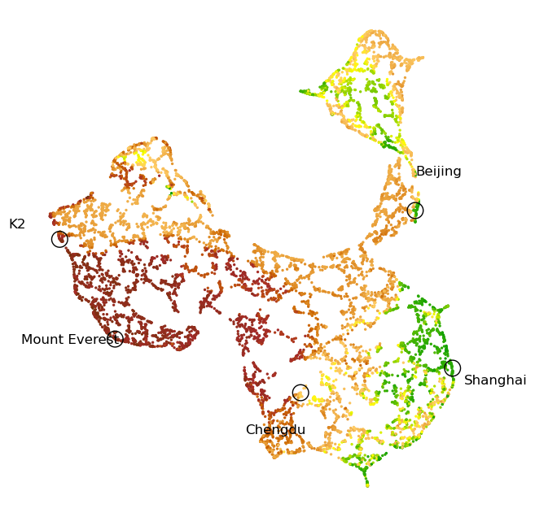 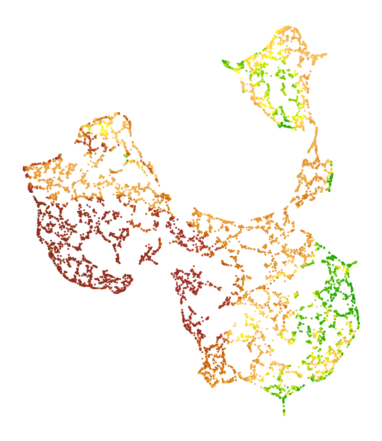 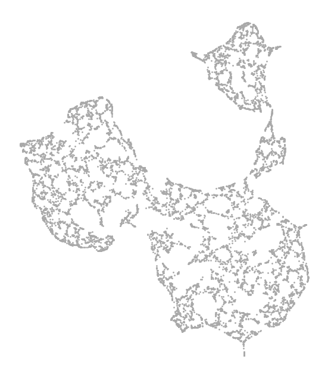  
   `N=10009, r=69, h=69`

---

This README summarizes the key points of the China map update. Please refer to specific sections in the full documentation for detailed methodology and analysis.
